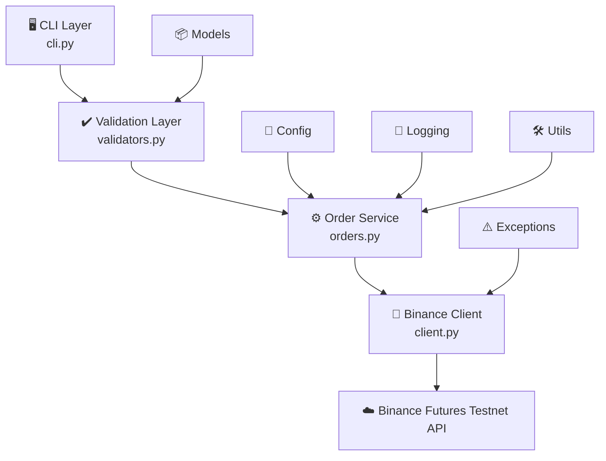

# Binance USDT-M Futures Testnet Trading Bot

A clean, layered, production-style CLI trading bot for placing **MARKET** and
**LIMIT** orders on the **Binance USDT-M Futures Testnet**. Built with
readability, extensibility, and safety (testnet-only, no hardcoded secrets)
as the primary goals.

---

## Project Overview

This bot lets you submit BUY/SELL, MARKET/LIMIT orders to Binance's Futures
Testnet from the command line, with:

- Strict input validation before anything is sent over the network
- Structured logging of every request, response, and error to `logs/trading.log`
- Typed, normalized error handling (network issues, auth failures, invalid
  symbols, rate limits, and unexpected errors are all caught and reported
  clearly -- the bot never crashes with a raw traceback)
- A polished CLI with optional color output
- An **interactive mode** for step-by-step prompted order entry
- A **dry-run mode** that validates and previews an order without submitting it

It is intentionally built like a small production service: each concern
(validation, orchestration, API access, logging, configuration) lives in its
own module, following the Single Responsibility Principle.

---


## Architecture

```



CLI Layer (cli.py)
      |
      v
Validation Layer (bot/validators.py)
      |
      v
Order Service (bot/orders.py)
      |
      v
Binance Client (bot/client.py)
      |
      v
Binance Futures Testnet API
```

- **CLI Layer** -- parses arguments / interactive input, formats output. Never
  talks to Binance directly.
- **Validation Layer** -- turns raw strings into a typed, guaranteed-valid
  `OrderRequest`. Pure logic, no I/O.
- **Order Service** -- orchestrates validation results into an actual order
  submission (or a dry-run simulation), times execution, and logs outcomes.
- **Binance Client** -- the only module that imports the `binance` SDK.
  Normalizes every possible failure into one of a small set of custom
  exceptions.
- **Config / Logging / Models / Utils / Exceptions** -- shared, cross-cutting
  concerns used by every layer above.

Extending the bot with a new order type (e.g. STOP_LIMIT, OCO, TWAP) only
requires: adding a member to `OrderType`, a branch in `OrderService._execute`,
and a matching method on `BinanceFuturesClient` -- no other layer changes.

---

## Folder Structure

```
trading_bot/
├── bot/
│   ├── __init__.py
│   ├── config.py            # Environment configuration loading
│   ├── client.py             # Binance API client wrapper
│   ├── orders.py             # Order orchestration service
│   ├── validators.py         # Input validation
│   ├── exceptions.py         # Custom exception hierarchy
│   ├── models.py             # Enums + dataclasses (OrderRequest, OrderResult, ...)
│   ├── logging_config.py     # Logging setup (console + rotating file)
│   └── utils.py              # Timing + colored-output helpers
├── logs/
│   └── trading.log           # Created automatically on first run
├── cli.py                    # CLI entry point
├── .env.example               # Template for required environment variables
├── README.md
├── requirements.txt
└── .gitignore
```

---

## Installation

Requires **Python 3.11+**.

```bash
cd trading_bot
python3 -m venv venv
source venv/bin/activate        # Windows: venv\Scripts\activate
pip install -r requirements.txt
```

---

## Setup

## How to Obtain Demo Trading API Keys

1. Open Binance Demo Trading - https://demo.binance.com/en/futures/BTCUSDT
2. Create or access your Demo Trading account.
3. Open the profile menu and select **Demo Trading API**.
4. Generate a new API Key and Secret.
5. Copy the credentials into the `.env` file.

> Note: Binance may change the onboarding flow over time. This project targets the Binance USDT-M Futures Testnet/Demo Trading API.

### 2. Environment Variables

Copy the example file and fill in your credentials:

```bash
cp .env.example .env
```

| Variable                     | Required | Description                                   |
|-------------------------------|----------|------------------------------------------------|
| `BINANCE_TESTNET_API_KEY`      | Yes      | Your Binance Futures Testnet API key            |
| `BINANCE_TESTNET_API_SECRET`   | Yes      | Your Binance Futures Testnet API secret         |
| `REQUEST_TIMEOUT_SECONDS`      | No       | HTTP request timeout in seconds (default `10`)  |

The bot only ever talks to `https://testnet.binancefuture.com`. This is
hardcoded in `bot/config.py` and is not user-configurable, by design.

---

## How to Run

### MARKET Example

```bash
python cli.py --symbol BTCUSDT --side BUY --type MARKET --quantity 0.01
```

### LIMIT Example

```bash
python cli.py --symbol BTCUSDT --side SELL --type LIMIT --quantity 0.01 --price 65000
```

### Interactive Mode

```bash
python cli.py --interactive
```

You'll be prompted step-by-step:

```
Interactive Order Entry
--------------------------------------------------
Symbol (e.g. BTCUSDT): btcusdt
Side (BUY/SELL): buy
Order type (MARKET/LIMIT): limit
Quantity: 0.01
Price: 65000
```

### Dry Run Mode

Validates input and prints exactly what *would* be sent to Binance, without
placing an order (no network call to submit an order is made):

```bash
python cli.py --symbol BTCUSDT --side BUY --type MARKET --quantity 0.01 --dry-run
```

`--dry-run` can be combined with `--interactive` as well.

### Sample Output

```
==================================================
Binance Futures Testnet Trading Bot
==================================================
Order Summary
Symbol   : BTCUSDT
Side     : BUY
Type     : MARKET
Quantity : 0.01
--------------------------------------------------
Submitting order...
Order Successful
Order ID      : 18525143124
Status        : NEW
Executed Qty  : 0.0
Average Price : N/A
==================================================
```

---

## Logging

- Logs are written to `logs/trading.log` (created automatically) using a
  rotating file handler (2 MB per file, 3 backups kept).
- Each log line includes a timestamp, level, logger name, and message.
- The bot logs: the validated order request, the raw Binance response,
  execution time, and full tracebacks for any exception.
- Console output stays clean (WARNING+ by default); pass `--verbose` to also
  see DEBUG-level logs on the console.

---

## Error Handling

All errors are caught and translated into clear, actionable messages -- the
bot never crashes with a raw traceback on the console (full tracebacks still
go to `logs/trading.log` for debugging). Handled cases include:

- Invalid/missing CLI arguments or interactive input
- Unsupported order type or side
- Non-positive quantity or price
- Missing price on a LIMIT order
- Malformed symbol format
- Missing/invalid API credentials (`ConfigurationError`)
- Binance authentication failures (`AuthenticationError`)
- Network timeouts / connection errors (`NetworkError`)
- Binance rate limiting (`RateLimitError`)
- Invalid trading symbol per Binance (`InvalidSymbolError`)
- Any other unexpected exception (caught at the top level of the CLI)

---

## Future Improvements

- Add STOP_LIMIT, OCO, and TWAP order types (architecture already supports
  this with minimal changes -- see Architecture section).
- Add automated tests (pytest) with a mocked `BinanceFuturesClient`.
- Add a `--config` flag to select between multiple `.env` profiles.
- Add position/balance inspection commands (read-only, no order placement).
- Add retry-with-backoff for transient network errors and rate limits.
- Add structured (JSON) logging output as an alternative to plain text, for
  easier ingestion by log aggregation tools.

---

## Assumptions

- Only USDT-M Futures Testnet is supported (no Spot, no Coin-M, no mainnet).
- LIMIT orders are always submitted with `timeInForce=GTC`.
- Quantity/price precision (step size, tick size) validation is delegated to
  Binance's own API-level rejection rather than duplicated client-side,
  since per-symbol exchange info can change independently of this bot.
- A single `.env` file provides one set of testnet credentials; multi-account
  support is out of scope for this version.
- `colorama` is an optional dependency for nicer terminal output; the CLI is
  fully functional (in plain text) without it.
