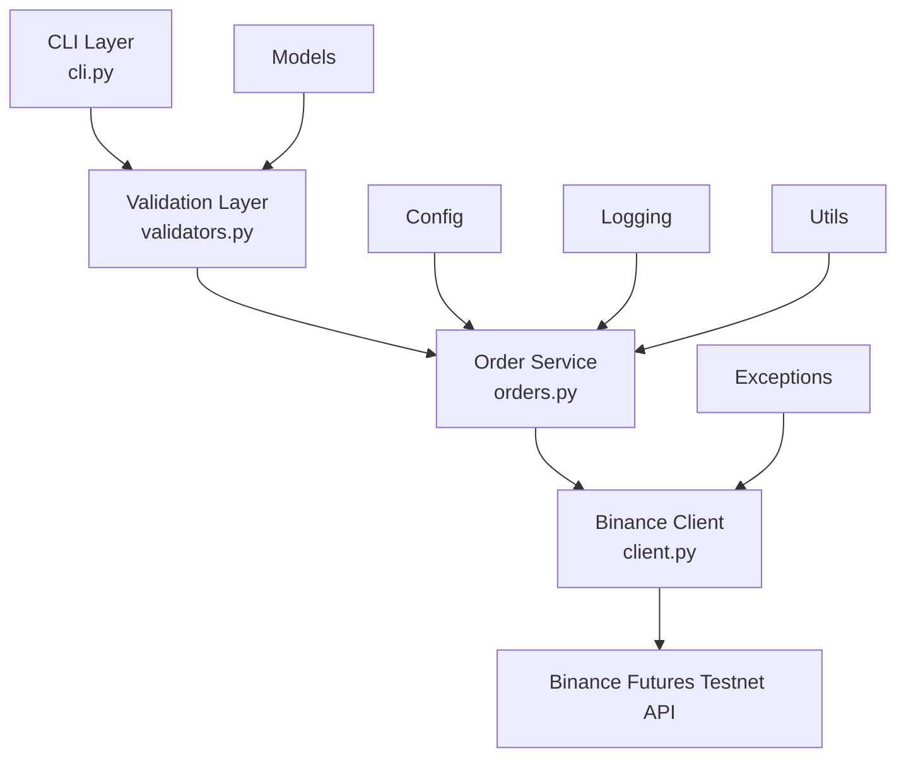

# Binance USDT-M Futures Testnet Trading Bot

A clean, layered, production-style CLI trading bot for placing **MARKET** and
**LIMIT** orders on the **Binance USDT-M Futures Testnet**. Built for
readability, extensibility, and safety — testnet-only, no hardcoded secrets,
no order ever leaves your machine until it's been fully validated.

---

## Table of Contents

- [Project Overview](#project-overview)
- [Architecture](#architecture)
- [Folder Structure](#folder-structure)
- [Installation](#installation)
- [Setup](#setup)
- [How to Run](#how-to-run)
- [Logging](#logging)
- [Error Handling](#error-handling)
- [Assumptions](#assumptions)

---

## Project Overview

This bot submits BUY/SELL, MARKET/LIMIT orders to Binance's Futures Testnet
from the command line, with:

| Feature | Description |
|---|---|
| **Strict validation** | Every field is checked before anything touches the network |
| **Structured logging** | Every request, response, and error is written to `logs/trading.log` |
| **Typed error handling** | Network issues, auth failures, invalid symbols, rate limits, and unexpected errors are all caught and reported clearly — never a raw traceback on screen |
| **Polished CLI** | Optional color output via `colorama`, with a plain-text fallback |
| **Interactive mode** | Step-by-step prompted order entry |
| **Dry-run mode** | Validates and previews an order without submitting it — zero network calls |

It's built like a small production service: each concern (validation,
orchestration, API access, logging, configuration) lives in its own module,
following the Single Responsibility Principle.

---

## Architecture



If your viewer doesn't render Mermaid diagrams, here's the same flow as plain text:

```
CLI Layer (cli.py)
      |
      v
Validation Layer (bot/validators.py)
      |
      v
Order Service (bot/orders.py)
      |
      v
Binance Client (bot/client.py)
      |
      v
Binance Futures Testnet API
```

**Layer responsibilities:**

- **CLI Layer** — parses arguments / interactive input, formats output. Never talks to Binance directly.
- **Validation Layer** — turns raw strings into a typed, guaranteed-valid `OrderRequest`. Pure logic, no I/O.
- **Order Service** — orchestrates validated input into an actual order submission (or a dry-run simulation), times execution, and logs outcomes.
- **Binance Client** — the only module that imports the `binance` SDK. Normalizes every possible failure into one of a small set of custom exceptions.
- **Config / Logging / Models / Utils / Exceptions** — shared, cross-cutting concerns used by every layer above.

Extending the bot with a new order type (e.g. `STOP_LIMIT`, `OCO`, `TWAP`) only requires: adding a member to `OrderType`, a branch in `OrderService._execute`, and a matching method on `BinanceFuturesClient` — no other layer changes.

---

## Folder Structure

```
trading_bot/
├── bot/
│   ├── __init__.py
│   ├── config.py            # Environment configuration loading
│   ├── client.py             # Binance API client wrapper
│   ├── orders.py             # Order orchestration service
│   ├── validators.py         # Input validation
│   ├── exceptions.py         # Custom exception hierarchy
│   ├── models.py             # Enums + dataclasses (OrderRequest, OrderResult, ...)
│   ├── logging_config.py     # Logging setup (console + rotating file)
│   └── utils.py              # Timing + colored-output helpers
├── logs/
│   └── trading.log           # Created automatically on first run
├── cli.py                    # CLI entry point
├── .env.example               # Template for required environment variables
├── README.md
├── requirements.txt
└── .gitignore
```

---

## Installation

Requires **Python 3.11+**.

```bash
cd trading_bot
python3 -m venv venv
source venv/bin/activate        # Windows: venv\Scripts\activate
pip install -r requirements.txt
```

---

## Setup

### 1. Get Binance Futures Testnet API Keys

> **Note:** Binance has been gradually rebranding "Futures Testnet" as
> "Demo Trading" in its UI. Both refer to the same underlying sandbox
> environment this bot connects to — the steps below work regardless of
> which name you see.

1. Go to the Binance Futures Testnet / Demo Trading portal:
   - Testnet portal: <https://testnet.binancefuture.com>
   - Or, from a regular Binance account: **Futures → Demo Trading**
2. Log in (the standalone testnet portal uses GitHub OAuth; Demo Trading via a regular account uses your normal Binance login).
3. Open the API management panel (usually labeled **API Key** or **Demo Trading API**).
4. Generate a new API Key / Secret pair.
5. Copy both values immediately — the secret is only shown once.
6. *(Optional)* Use the built-in faucet to fund your test USDT-M futures wallet.

### 2. Configure Environment Variables

Copy the example file and fill in your credentials:

```bash
cp .env.example .env
```

| Variable | Required | Description |
|---|---|---|
| `BINANCE_TESTNET_API_KEY` | Yes | Your Binance Futures Testnet API key |
| `BINANCE_TESTNET_API_SECRET` | Yes | Your Binance Futures Testnet API secret |
| `REQUEST_TIMEOUT_SECONDS` | No | HTTP request timeout in seconds (default `10`) |

The bot only ever talks to `https://testnet.binancefuture.com`. This is
hardcoded in `bot/config.py` and is **not** user-configurable, by design —
there is no code path that can point this bot at mainnet.

---


## How to Run

### MARKET Order

```bash
python cli.py --symbol BTCUSDT --side BUY --type MARKET --quantity 0.01
```

### LIMIT Order

```bash
python cli.py --symbol BTCUSDT --side SELL --type LIMIT --quantity 0.01 --price 65000
```

### Interactive Mode

```bash
python cli.py --interactive
```

You'll be prompted step-by-step:

```
Interactive Order Entry
--------------------------------------------------
Symbol (e.g. BTCUSDT): btcusdt
Side (BUY/SELL): buy
Order type (MARKET/LIMIT): limit
Quantity: 0.01
Price: 65000
```

### Dry Run Mode

Validates input and prints exactly what *would* be sent to Binance, without
submitting an order. No network call is made at all.

```bash
python cli.py --symbol BTCUSDT --side BUY --type MARKET --quantity 0.01 --dry-run
```

`--dry-run` can be combined with `--interactive` too.

### Sample Output

```
==================================================
Binance Futures Testnet Trading Bot
==================================================
Order Summary
Symbol   : BTCUSDT
Side     : BUY
Type     : MARKET
Quantity : 0.01
--------------------------------------------------
Submitting order...
Order Successful
Order ID      : 18525143124
Status        : NEW
Executed Qty  : 0.0
Average Price : N/A
==================================================
```

> Note: MARKET orders on the testnet occasionally report `status: NEW` with
> `executedQty: 0.0` for a brief moment before the fill is reflected —
> this is expected testnet behavior, not a bug in the bot.

---

## Logging

- Logs are written to `logs/trading.log` (created automatically) using a rotating file handler (2 MB per file, 3 backups kept).
- Each log line includes a timestamp, level, logger name, and message.
- Logged on every run: the validated order request, the raw Binance response, execution time, and full tracebacks for any exception.
- Console output stays clean (`WARNING`+ by default); pass `--verbose` to also see `DEBUG`-level logs on the console.

---

## Error Handling

All errors are caught and translated into clear, actionable messages — the
bot never crashes with a raw traceback on the console (full tracebacks still
go to `logs/trading.log` for debugging). Handled cases:

- Invalid or missing CLI arguments / interactive input
- Unsupported order type or side
- Non-positive quantity or price
- Missing price on a LIMIT order
- Malformed symbol format
- Missing or invalid API credentials (`ConfigurationError`)
- Binance authentication failures (`AuthenticationError`)
- Network timeouts / connection errors (`NetworkError`)
- Binance rate limiting (`RateLimitError`)
- Invalid trading symbol per Binance (`InvalidSymbolError`)
- Any other unexpected exception (caught at the top level of the CLI)

---

## Assumptions

- Only USDT-M Futures Testnet is supported (no Spot, no Coin-M, no mainnet).
- LIMIT orders are always submitted with `timeInForce=GTC`.
- Quantity/price precision (step size, tick size) validation is delegated to Binance's own API-level rejection rather than duplicated client-side, since per-symbol exchange info can change independently of this bot.
- A single `.env` file provides one set of testnet credentials; multi-account support is out of scope for this version.
- `colorama` is an optional dependency for nicer terminal output; the CLI is fully functional (in plain text) without it.
